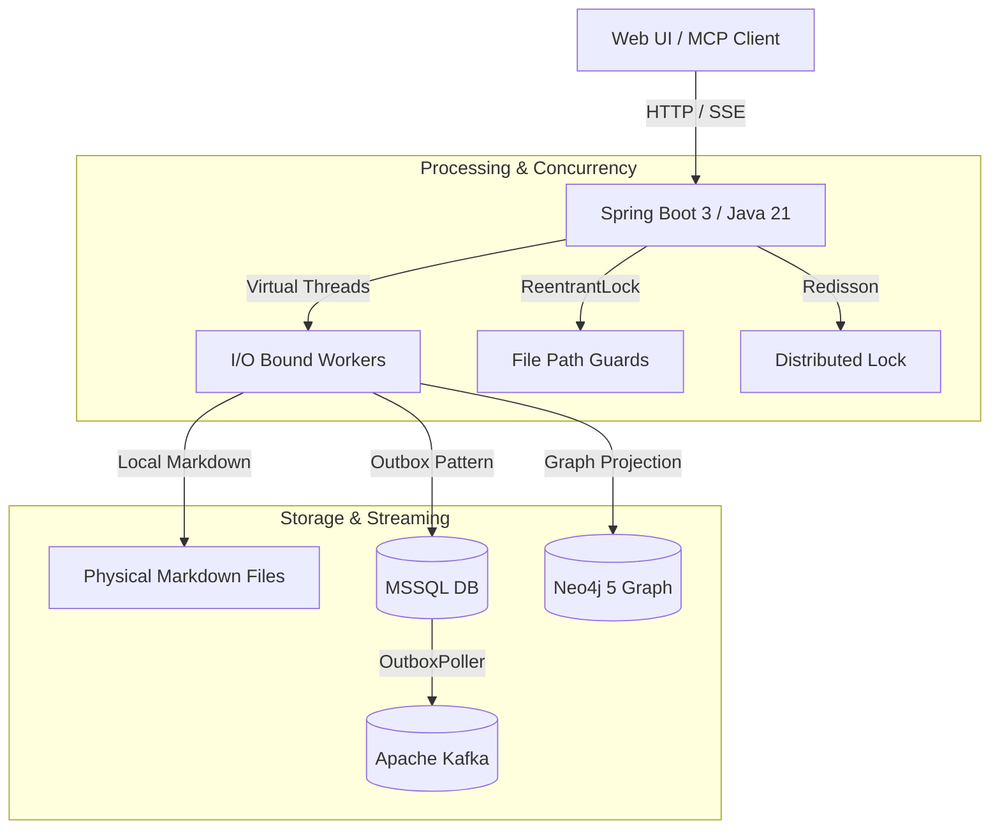

# 🧠 AIMS-Graph

> **Andrej Karpathy's LLM Wiki Pattern & Neo4j Knowledge Graph Engine**  
> 비정형 텍스트를 Zettelkasten 마크다운 위키와 Neo4j 지식 그래프로 자동 변환하는 고성능 백엔드 시스템입니다.

---

<p align="left">
  
  
  
  
  
  
</p>

---

## ⚡ Architecture Overview



---

## 🚀 Quick Start (실행 가이드)

### 사전 요구사항 (Prerequisites)
- **Java 21** (JDK 21+)
- **Docker Desktop** 실행 상태
- 시스템 환경변수 `OPENAI_API_KEY` 설정

---

### 방법 A. 원클릭 실행 (Windows 추천)
프로젝트 루트의 `start-all.bat`을 실행하면 Docker 컨테이너 기동, 포트 대기, 백엔드 및 프론트엔드가 일괄 실행됩니다.
```cmd
start-all.bat
```

### 방법 B. 단계별 수동 실행

#### 1. 인프라 컨테이너 기동 (Docker Compose)
MSSQL, Neo4j, Kafka, Redis를 백그라운드로 실행합니다:
```bash
cd aims-backend
docker-compose up -d
```

#### 2. 백엔드 서버 실행
```bash
./gradlew bootRun
```
> 서버가 정상 기동되면 `http://localhost:8080` 포트에서 대기합니다.

#### 3. 프론트엔드 웹 UI 실행 (새 터미널)
```bash
cd frontend
npm install  # 최초 1회만 필요
npm run dev
```
> 웹 브라우저에서 `http://localhost:3000`으로 접속하여 지식 위키 및 그래프 시각화 UI를 확인할 수 있습니다.

---

## 📡 Core API Specification

### 1) 시스템 및 LLM 연동 상태 헬스체크 (No Auth)
```bash
curl -X GET http://localhost:8080/api/v1/llm/health
```

### 2) 사용자 등록 및 JWT 토큰 발급
```bash
# 1. 회원가입
curl -X POST http://localhost:8080/api/v1/auth/register \
  -H "Content-Type: application/json" \
  -d '{"username": "tester", "password": "password123"}'

# 2. 로그인 (토큰 획득)
curl -X POST http://localhost:8080/api/v1/auth/login \
  -H "Content-Type: application/json" \
  -d '{"username": "tester", "password": "password123"}'
```

### 3) 지식 수집 및 위키 컴파일 (Ingestion)
원문 텍스트를 주입하여 마크다운 위키 페이지와 Neo4j 노드/엣지를 자동 추출합니다.
```bash
curl -X POST http://localhost:8080/api/v1/ingest \
  -H "Content-Type: application/json" \
  -H "Authorization: Bearer {JWT_TOKEN}" \
  -d '{
    "sourceText": "Kafka는 분산 이벤트 스트리밍 플랫폼이며, Zookeeper 또는 KRaft에 의존한다."
  }'
```

---

## 🧪 Testing & Verification

```bash
cd aims-backend

# 전체 단위 및 통합 테스트 실행 (100% PASS)
./gradlew test

# 코드 스타일 포맷 검사
./gradlew spotlessCheck
```

---

## 📂 Detailed Documentation
더 자세한 기술 설계 및 기획 문서는 `docs/` 디렉토리를 참조하세요.
- [Architecture Deep-Dive](docs/ARCHITECTURE.md)
- [Database & Graph Schema](docs/SCHEMA.md)
- [REST API Specification](docs/API_SPEC.md)
- [Architecture Decision Records (ADR)](docs/ADR.md)
