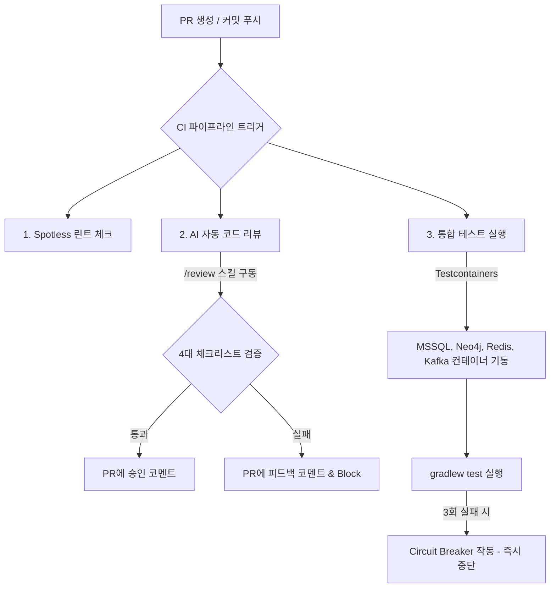

# AI 코드 리뷰 및 테스트 자동화 파이프라인 구축 가이드 (PIPELINE_GUIDE.md)

이 가이드는 AIMS-Graph 프로젝트의 헌법(`GEMINI.md`) 및 가드레일 규칙(`rules/common/project-rules.md`)을 준수하며, 개발 생산성을 극대화하기 위한 **AI 기반 코드 리뷰 및 테스트 자동화 파이프라인(CI/CD)**의 구축 방안을 다룹니다.

---

## 1. 파이프라인 아키텍처 개요

AIMS-Graph는 다중 인프라(MSSQL, Neo4j, Kafka, Redis)와 가상 스레드 동시성 제어, 그리고 엄격한 아키텍처 제약(LLM Wiki Pattern, NO RAG)을 따릅니다. 따라서 자동화 파이프라인은 단순 코드 빌드뿐만 아니라 **구조적 제약 조건 검증(AI 코드 리뷰)**과 **실제 인프라 기반의 통합 테스트(Testcontainers)**를 필수로 포함해야 합니다.



---

## 2. AI 자동 코드 리뷰 구축 (/review 연동)

`.agents/skills/review/SKILL.md`에 명시된 4대 자동 체크리스트를 GitHub Pull Request 또는 커밋 단계에서 검증하도록 파이프라인을 구축합니다.

### 2.1 4대 핵심 체크리스트
1. **Architecture Check**: `docs/ARCHITECTURE.md`에 정의된 레이어드 및 EDA 아키텍처 폴더 구조 준수 여부.
2. **ADR Check**: `docs/ADR.md`에서 합의된 기술 스택(Spring Boot 3.x, MyBatis, Redisson, 가상 스레드 친화적 동기화 장치 등) 준수 여부.
3. **TDD Guard Check**: 구현 코드(`src/main/`) 추가/수정 시 그에 대응하는 테스트 파일(`src/test/`)의 병행 작성 여부.
4. **Critical Rules Check**: RAG(Vector DB, 임베딩) 도입 시도 금지(NO RAG), 파괴적 명령어(`rm -rf`, `DROP DATABASE` 등) 존재 여부 검사.

### 2.2 GitHub Actions 기반 AI 리뷰 워크플로우 구성 예시
PR이 생성되거나 업데이트될 때 AI 에이전트(혹은 Antigravity CLI)를 기동시켜 코드 디프(Diff)를 입력받고, `/review` 규칙을 적용한 피드백을 PR 코멘트로 게시합니다.

```yaml
# .github/workflows/ai-code-review.yml
name: AI Code Review

on:
  pull_request:
    types: [opened, synchronize]
    paths:
      - 'aims-backend/src/**'
      - 'frontend/src/**'

jobs:
  review:
    runs-on: ubuntu-latest
    steps:
      - name: Checkout Code
        uses: actions/checkout@v4
        with:
          fetch-depth: 0

      - name: Setup Node.js
        uses: actions/setup-node@v4
        with:
          node-version: '20'

      - name: Run AI Review Script
        env:
          GITHUB_TOKEN: ${{ secrets.GITHUB_TOKEN }}
          OPENAI_API_KEY: ${{ secrets.OPENAI_API_KEY }}
        run: |
          # 1. PR Diff 추출
          git diff origin/${{ github.base_ref }}...HEAD > pr_diff.txt
          
          # 2. AI 리뷰 헬퍼 스크립트 실행 (PR Diff 및 프로젝트 rules/docs 컨텍스트 주입)
          node .github/scripts/run-ai-review.js pr_diff.txt
```

### 2.3 AI 리뷰어 실행 스크립트 (`run-ai-review.js` 예시)
이 스크립트는 PR Diff를 분석하여, `docs/` 및 `rules/` 내 문서를 참고해 4대 검증을 수행하고 결과를 GitHub API를 통해 PR 코멘트로 전송합니다.

```javascript
// .github/scripts/run-ai-review.js
const fs = require('fs');
const { Octokit } = require('@octokit/action');

async function main() {
  const diff = fs.readFileSync(process.argv[2], 'utf8');
  const octokit = new Octokit();
  
  // 1. OpenAI 또는 DeepSeek API를 활용해 Diff 스캔
  // System Prompt에 GEMINI.md, project-rules.md 및 docs/의 제약 조건을 주입
  const systemPrompt = `
  You are the AI Code Reviewer for AIMS-Graph. Verify the diff against these CRITICAL Rules:
  1. NO RAG: Reject any usage of Vector DB, Document Chunking, Embedding or Cosine Similarity. We only use Processed Wiki & Agentic Graph Traversal (Neo4j).
  2. TDD Guard: Ensure modified implementation files have corresponding test files.
  3. Security & Destructive Command Guard: Look for 'rm -rf', 'DROP DATABASE', 'git reset --hard', etc.
  4. B2B Multi-tenancy: Ensure workspaceId follows 'ws-username' naming convention.
  5. Virtual Thread Sync: Ensure no 'synchronized' keyword on I/O operations (use ReentrantLock instead).
  
  Format your feedback as clear markdown bullet points with PASS/FAIL status.
  `;

  // API 호출 후 피드백 결과 획득 (생략)
  const reviewFeedback = await callAiModel(systemPrompt, diff);

  // 2. GitHub PR에 리뷰 코멘트 게시
  const [owner, repo] = process.env.GITHUB_REPOSITORY.split("/");
  const prNumber = parseInt(process.env.GITHUB_REF.split("/")[2]);

  await octokit.issues.createComment({
    owner,
    repo,
    issue_number: prNumber,
    body: reviewFeedback,
  });
}
```

---

## 3. 테스트 자동화 파이프라인 구축 (Testcontainers)

AIMS-Graph는 인메모리 H2 데이터베이스 등을 테스트에 사용하는 것을 **금지**하며, 실 운영 환경과 동일한 도커 기반 컨테이너 의존성(Testcontainers)을 활용해야 합니다.

### 3.1 Testcontainers 기반 추상 테스트 클래스 설계
모든 통합 테스트(`Integration Test`)가 상속받아 사용할 수 있도록, MSSQL, Neo4j, Redis, Kafka 컨테이너의 싱글톤 인스턴스를 관리하는 베이스 클래스를 제공합니다.

```java
// src/test/java/com/aimsgraph/testcontainers/AbstractContainerBaseTest.java
package com.aimsgraph.testcontainers;

import org.springframework.test.context.DynamicPropertyRegistry;
import org.springframework.test.context.DynamicPropertySource;
import org.testcontainers.containers.KafkaContainer;
import org.testcontainers.containers.MSSQLServerContainer;
import org.testcontainers.containers.Neo4jContainer;
import org.testcontainers.containers.GenericContainer;
import org.testcontainers.utility.DockerImageName;

public abstract class AbstractContainerBaseTest {

    static final MSSQLServerContainer<?> mssql;
    static final Neo4jContainer<?> neo4j;
    static final GenericContainer<?> redis;
    static final KafkaContainer kafka;

    static {
        mssql = new MSSQLServerContainer<>("mcr.microsoft.com/mssql/server:2022-latest")
                .acceptLicense();
        neo4j = new Neo4jContainer<>("neo4j:5-community")
                .withAdminPassword("password");
        redis = new GenericContainer<>(DockerImageName.parse("redis:7-alpine"))
                .withExposedPorts(6379);
        kafka = new KafkaContainer(DockerImageName.parse("confluentinc/cp-kafka:7.6.0"));

        // 컨테이너 멀티스레드 병렬 구동
        mssql.start();
        neo4j.start();
        redis.start();
        kafka.start();
    }

    @DynamicPropertySource
    static void registerProperties(DynamicPropertyRegistry registry) {
        // MSSQL 동적 프로퍼티 주입
        registry.add("spring.datasource.url", mssql::getJdbcUrl);
        registry.add("spring.datasource.username", mssql::getUsername);
        registry.add("spring.datasource.password", mssql::getPassword);

        // Neo4j 동적 프로퍼티 주입
        registry.add("spring.neo4j.uri", neo4j::getBoltUrl);
        registry.add("spring.neo4j.authentication.username", () -> "neo4j");
        registry.add("spring.neo4j.authentication.password", () -> "password");

        // Redis 동적 프로퍼티 주입
        registry.add("spring.redis.host", redis::getHost);
        registry.add("spring.redis.port", () -> redis.getMappedPort(6379));

        // Kafka 동적 프로퍼티 주입
        registry.add("spring.kafka.bootstrap-servers", kafka::getBootstrapServers);
    }
}
```

### 3.2 CI 환경 테스트 및 빌드 자동화 워크플로우
로컬 테스트 명령은 `./gradlew test`를 수행하며, CI 단계에서도 동일하게 Testcontainers가 도커 데몬을 통해 도커 내 도커(Docker-in-Docker, DinD) 또는 호스트 도커 소켓 공유 방식으로 구동되도록 설정합니다.

```yaml
# .github/workflows/test-automation.yml
name: Test Automation Pipeline

on:
  push:
    branches: [ main, develop ]
  pull_request:
    branches: [ main, develop ]

jobs:
  build-and-test:
    runs-on: ubuntu-latest

    services:
      # Docker daemon은 GitHub Actions 기본 러너에 기동되어 있으므로 별도 정의 불요 (도커 소켓 바인딩 활용)
      
    steps:
      - name: Checkout Code
        uses: actions/checkout@v4

      - name: Set up JDK 21
        uses: actions/setup-java@v4
        with:
          java-version: '21'
          distribution: 'temurin'
          cache: 'gradle'

      - name: Spotless Format Check
        run: ./gradlew spotlessCheck
        working-directory: aims-backend

      - name: Run Tests (with Testcontainers)
        env:
          OPENAI_API_KEY: ${{ secrets.OPENAI_API_KEY }}
        run: ./gradlew test --info
        working-directory: aims-backend

      - name: Build Artifacts
        if: success()
        run: ./gradlew build -x test
        working-directory: aims-backend
```

---

## 4. 서브 에이전트 자율 구현 하네스(Harness) 파이프라인과의 연계

`.agents/skills/harness/SKILL.md`에 정의된 **하네스 엔진**은 프로젝트 분석부터 코딩까지를 자동 제어하는 헤드리스 멀티 에이전트 파이프라인입니다. CI/CD 및 자동 테스트 파이프라인은 하네스 자율 구현 작업과 긴밀히 연계되어 안전망 역할을 수행합니다.

1. **로컬 Guard 실행**: 서브 에이전트가 `invoke_subagent`를 통해 특정 태스크를 자율 수행한 직후, 로컬에서 `./gradlew spotlessCheck` 및 `./gradlew test`를 우선 실행하여 테스트 검증(Green)을 확인합니다.
2. **Circuit Breaker 연동**: 테스트 실행 도중 3회 연속 오류가 나면 서브 에이전트의 작업 루프를 일시 중단하고 예외 스택 트레이스를 기록한 뒤 즉시 사용자 개입을 요청합니다.
3. **PR 생성 및 CI 게이트 연동**: 로컬에서 검증이 완료된 코드는 `github` 스킬을 사용해 원격 레포지토리에 커밋/푸시 및 PR 생성이 수행되며, 이때 위에서 구축한 GitHub Actions의 **AI 코드 리뷰 및 Testcontainers 파이프라인**이 마지막 게이트 키퍼(Gate Keeper)로서 코드 품질을 최종 승인합니다.

---

## 5. 파이프라인 도입 효과 및 향후 발전 방향

- **아키텍처 철학 오염 방지**: NO RAG 및 물리 위키 기반 지식 그래프 탐색 구조를 강제하여 우발적인 유사도 기반 청킹 RAG 코드 인입을 원천 차단합니다.
- **가상 스레드 안전성 보장**: 테스트 빌드 단계에서 고부하 I/O 및 동시성 시나리오 테스트를 실행하여 가상 스레드 캐리어 피닝이나 락 경쟁 문제를 사전에 예방합니다.
- **B2B 테넌트 보안 격리**: 신규 기능 추가 시, 타인 소유의 워크스페이스 ID 노드 또는 물리 디렉토리 접근 시도가 있는 코드를 4대 체크리스트가 잡아냅니다.
